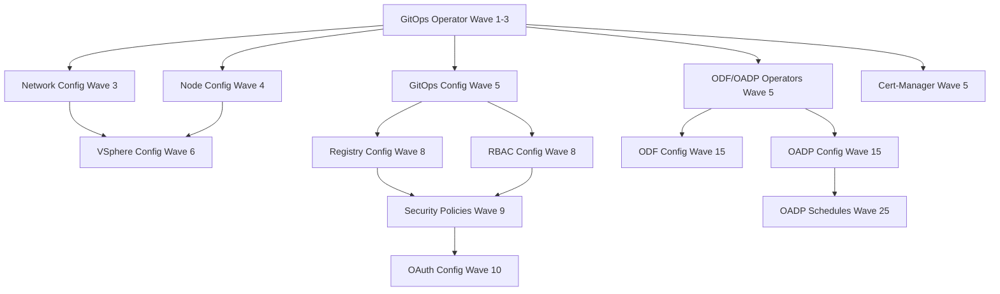

# 🎉 Complete Critical Infrastructure Components - OCP-DEV Ready

## 📊 **Comprehensive Component Status**

### ✅ **Phase 1: Core Infrastructure** (Sync Wave 1-10)
1. **GitOps Operator** (Wave 1-3) - ✅ Self-management capability
2. **Network Configuration** (Wave 3) - ✅ OVN-Kubernetes & ingress
3. **Node Configuration** (Wave 4) - ✅ Infrastructure nodes & topology
4. **GitOps Configuration** (Wave 5) - ✅ ArgoCD cluster setup
5. **Image Registry** (Wave 8) - ✅ Container registry with storage
6. **RBAC Configuration** (Wave 8) - ✅ Role-based access control

### ✅ **Phase 2: Storage & Data Protection** (Sync Wave 5-25)
7. **ODF Operator** (Wave 5) - ✅ OpenShift Data Foundation
8. **ODF Configuration** (Wave 15) - ✅ Storage cluster setup
9. **OADP Operator** (Wave 5) - ✅ Backup operator
10. **OADP Configuration** (Wave 15) - ✅ Backup configuration
11. **OADP Scheduled Backups** (Wave 25) - ✅ Automated backups

### ✅ **Phase 3: Platform Integration** (Sync Wave 6-9)
12. **VSphere Configuration** (Wave 6) - ✅ Platform-specific settings
13. **Security Policies** (Wave 9) - ✅ Network & pod security

### ✅ **Phase 4: Authentication & Security** (Sync Wave 10)
14. **OAuth Configuration** (Wave 10) - ✅ Azure AD SSO
15. **Cert-Manager Operator** (Wave 5) - ✅ Certificate management

### 🔧 **Phase 5: Optional Advanced Components** (Disabled by default)
16. **ACM Operator** - Advanced Cluster Management
17. **ACM Configuration** - Multi-cluster management
18. **Vault Config Operator** - HashiCorp Vault integration
19. **Kube-Ops-View** - Cluster visualization

## 🚀 **Deployment Summary**

### **Total Components**: 19 (15 enabled + 4 optional)
### **Sync Waves**: Properly ordered 1-25 for dependency management
### **GitOps Ready**: All components configured for ArgoCD management
### **Security**: Secrets sanitized with placeholders for safe repository storage

## 📋 **Deployment Order & Dependencies**

## 🎯 **Ready for OCP-DEV Testing**

### **Prerequisites Complete**:
- ✅ Repository linked to GitHub
- ✅ All critical components created
- ✅ Deployment scripts ready
- ✅ Verification scripts ready
- ✅ Documentation complete
- ✅ Security best practices implemented

### **Next Steps**:
1. **Login to ocp-dev cluster**
2. **Run deployment script**: `./scripts/deploy-critical-components.sh`
3. **Verify deployment**: `./scripts/verify-deployment.sh`
4. **Access ArgoCD UI** for ongoing management
5. **Test each component phase** before production deployment

### **Production Readiness**:
Once validated on ocp-dev, the same GitOps pattern can be deployed to ocp-prd with:
- Environment-specific values in `clusters/prd/values.yaml`
- Production secrets properly managed
- Production-specific network and storage configurations

## 📚 **Documentation Available**:
- `docs/CRITICAL-COMPONENTS-DEPLOYMENT.md` - Complete deployment guide
- `docs/SECRETS-MANAGEMENT.md` - Security best practices
- `docs/CLUSTER-INFRASTRUCTURE-ANALYSIS.md` - Original requirements analysis

Your ocp-dev cluster is now ready for comprehensive GitOps infrastructure testing! 🚀
